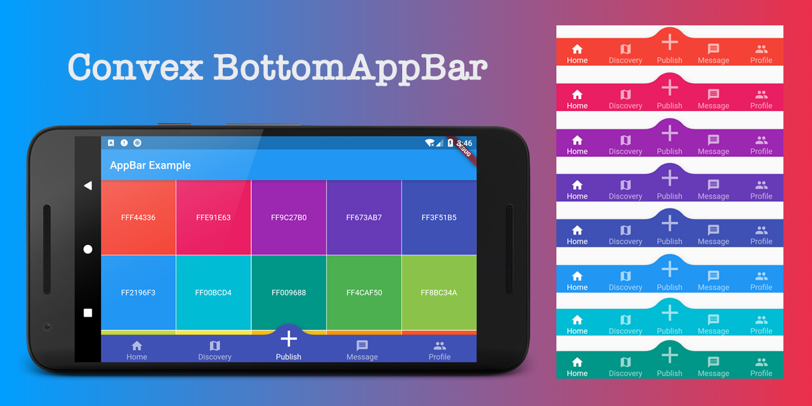

Language: [English](README.md) | [中文简体](README-zh.md)

# convex_bottom_bar

使用Flutter提供的`BottomAppBar`，可以实现FAB以凹陷的形式嵌入AppBar, 但是视觉设计稿有时会要求展示一个凸起的效果。 我们开发`ConvexAppBar`正是为了解决这个诉求，实现思路受`BottomAppBar`和 `NotchShape`启发。


**安装Demo** [app-release.apk](doc/app-release.apk)

## 快速上手
通常`ConvexAppBar`都是`Scaffold`和配合工作，只需要设置`bottomNavigationBar`属性。

`ConvexAppBar`提供两个构造函数，使用`ConvexAppBar()`的时候将启用默认的一套样式配置，可以大幅简化Tab的创建工作。 


```yaml
dependencies:
  convex_bottom_bar: ^0.0.1
```

```dart
Scaffold(
  bottomNavigationBar: ConvexAppBar(
    items: TAB_ITEMS,
    onTap: (int i) => setState(() {
      _selectedIndex = i;
    }),
    actionItem: const TabItem(icon: Icons.add, title: "Publish"),
    onTapActionButton: () => setState(() {
      _selectedIndex = -1;
    }),
  ),
);
```

## 目录

- [个性化配置](#个性化配置)

- [自定义案例](#自定义案例)

- [Contribution](#contribution)

- [帮助](#help)

## 个性化配置
使用默认构造函数时，可以进行一定的个性化配置，可配置的属性如下：


| Attributes      | Description                           |
| --------------- | ------------------------------------- |
| backgroundColor | AppBar background                     |
| height          | AppBar height                         |
| color           | tab icon/text color                   |
| activeColor     | tab icon/text color **when selected** |
| curveSize       | size of the convex shape              |
| top   | top edge of the convex shape relative to AppBar |


## 自定义案例
除了内置的样式，还可以完全自定义Tab的构建，这时候请使用`ConvexAppBar.builder()`构造器，下面是一个实现的示例：


```dart
Scaffold(
  bottomNavigationBar: ConvexAppBar.builder(
    count: items.length,
    backgroundColor: _tabBackgroundColor,
    tabBuilder: (BuildContext context, int index, bool active) {
      var navigationItem = items[index];
      var _color = active ? Colors.white : Colors.white60;
      var _icon = active
          ? navigationItem.activeIcon ?? navigationItem.icon
          : navigationItem.icon;
      return Container(
        color: Colors.transparent,
        padding: EdgeInsets.only(bottom: 2),
        child: Column(
          mainAxisAlignment: MainAxisAlignment.end,
          children: <Widget>[
            Icon(_icon, color: _color),
            Text(navigationItem.title, style: TextStyle(color: _color))
          ],
        ),
      );
    },
    actionBuilder: (BuildContext context, int index, bool active) {
      var _color = active ? Colors.white : Colors.white60;
      return Stack(
        alignment: Alignment.center,
        children: <Widget>[
          SizedBox(
            width: 60,
            height: 60,
            child: Container(
              decoration:
                  BoxDecoration(shape: BoxShape.circle, color: _color),
              child: Icon(
                Icons.add,
                size: 40,
                color: _tabBackgroundColor,
              ),
            ),
          )
        ],
      );
    },
  ),
);
```

## Contribution
Please file feature requests and bugs at the [issue tracker](https://github.com/hacktons/convex_bottom_bar/issues).

## Help
For more detail, please refer to the [example](example) project.
