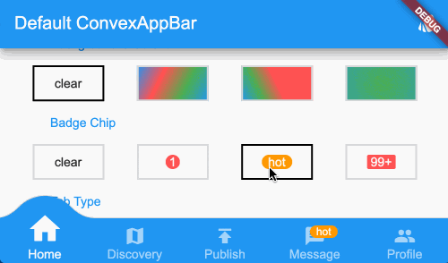
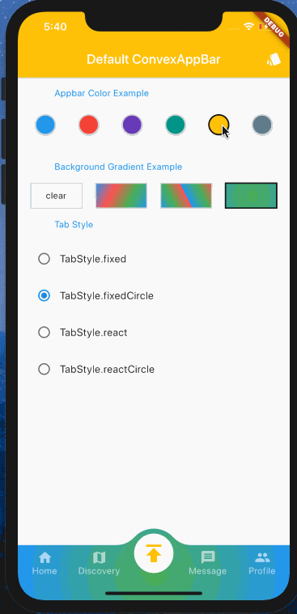

Languages: [English](README.md)|[简体中文](README-zh.md)
# convex_bottom_bar

[](https://pub.dartlang.org/packages/convex_bottom_bar)
[](https://github.com/hacktons/convex_bottom_bar)
[](https://codemagic.io/apps/5db10f597d3edb001a6ede16/5db10f597d3edb001a6ede15/latest_build)
[](https://coveralls.io/github/hacktons/convex_bottom_bar)

<a href="https://flutter.dev/docs/development/packages-and-plugins/favorites">

</a>

**convex_bottom_bar is now a [Flutter Favorite](https://flutter.dev/docs/development/packages-and-plugins/favorites) package!**

The official BottomAppBar can only display a notch FAB with app bar, sometimes we need a convex FAB. This ConvexAppBar is inspired by BottomAppBar and NotchShape's implementation.

Online example can be found at [https://appbar.codemagic.app](https://appbar.codemagic.app).

Here are some supported style:

|            **fixed**             |            **react**             | **badge chip** |
| :------------------------------: | :------------------------------: | :------------------------------: |
|         |         |  |
|         **fixedCircle**          |         **reactCircle**       | **flip** |
|  |  |  |
|            **textIn**            |          **titled**          | **tab image** |
|    |        |  |

**Flutter Version Support**
As the flutter is developing fast. There can be some breaking changes, we will trying to support the
stale version and beta version through different package version.

|            **Stable Flutter Version**             |            **Package Version**             | **More** |
| :------------------------------: | :------------------------------: | :------------------------------: |
|    >=1.20    |    >=2.4.0      | Since v1.20, the stable version changed the Stack API |
|    <1.20     |    <=2.3.0      | Support for stable version such as v1.17, v1.12 is not going be updated |

## How to use
Typically ConvexAppBar can work with `Scaffold` by setup its `bottomNavigationBar`.

The `ConvexAppBar` has to two constructors, the `ConvexAppBar()` will use default style to simplify the tab creation.

Add this to your package's pubspec.yaml file, use the latest version [](https://pub.dartlang.org/packages/convex_bottom_bar):

```yaml
dependencies:
  convex_bottom_bar: ^latest_version
```
You like the package ? buy me a kofi :)

<a href='https://ko-fi.com/hacktons' target='_blank'></a>

```dart
import 'package:convex_bottom_bar/convex_bottom_bar.dart';

Scaffold(
  bottomNavigationBar: ConvexAppBar(
    items: [
      TabItem(icon: Icons.home, title: 'Home'),
      TabItem(icon: Icons.map, title: 'Discovery'),
      TabItem(icon: Icons.add, title: 'Add'),
      TabItem(icon: Icons.message, title: 'Message'),
      TabItem(icon: Icons.people, title: 'Profile'),
    ],
    initialActiveIndex: 2,//optional, default as 0
    onTap: (int i) => print('click index=$i'),
  )
);
```

If you only need a single button, checkout the `ConvexButton`.


```dart
Scaffold(
  appBar: AppBar(title: const Text('ConvexButton Example')),
  body: Center(child: Text('count $count')),
  bottomNavigationBar: ConvexButton.fab(
    onTap: () => setState(() => count++),
  ),
);
```

## Features
* Provide multiple internal styles
* Ability to change the theme of AppBar
* Provide builder API to customize new style
* Add badge on tab menu
* Elegant transition animation
* Provide hook API to override some of internal styles
* RTL support

## Table of contents

- [Badge](#badge)

- [Theming](#theming)

- [Custom Example](#custom-example)

- [Style Hook](#style-hook)

- [RTL Support](#rtl-support)

- [FAQ](#faq)

- [Contribution](#contribution)

## Badge
If you need to add badge on the tab, use `ConvexAppBar.badge` to get it done. 

[](doc/badge-demo.mp4 "badge demo")

```dart
ConvexAppBar.badge({0: '99+', 1: Icons.assistant_photo, 2: Colors.redAccent},
  items: [
    TabItem(icon: Icons.home, title: 'Home'),
    TabItem(icon: Icons.map, title: 'Discovery'),
    TabItem(icon: Icons.add, title: 'Add'),
  ],
  onTap: (int i) => print('click index=$i'),
);
```

The `badge()` method accept an array of badges; The `badges` is map with tab items, each value of entry can be either `String`, `IconData`, `Color` or `Widget`. 

## Theming
The bar will use default style, you may want to theme it. Here are some supported attributes:


| Attributes      | Description                           |
| --------------- | ------------------------------------- |
| backgroundColor | AppBar background                     |
| gradient        | gradient will override backgroundColor|
| height          | AppBar height                         |
| color           | tab icon/text color                   |
| activeColor     | tab icon/text color **when selected** |
| curveSize       | size of the convex shape              |
| top   | top edge of the convex shape relative to AppBar |
| cornerRadius    | Draw the background with topLeft and topRight corner; Only work work with fixed style |
| style | style to describe the convex shape: **fixed, fixedCircle, react, reactCircle**, ... |
| chipBuilder | custom badge builder, use **ConvexAppBar.badge** for default badge |



## Custom Example

If the default style does not match with your situation, try with `ConvexAppBar.builder()`, which allow you to custom nearly all the tab features.

```dart
Scaffold(
  bottomNavigationBar: ConvexAppBar.builder(
    count: 5,
    backgroundColor: Colors.blue,
    style: TabStyle.fixed,
    itemBuilder: Builder(),
  )
);

/*user defined class*/
class Builder extends DelegateBuilder {
  @override
  Widget build(BuildContext context, int index, bool active) {
    return Text('TAB $index');
  }
}
```

Full custom example can be found at [example](example). 

## Style Hook
Hook for internal tab style. Unlike the `ConvexAppBar.builder`, you may want to update the tab style without define a new tab style.

**Warning:**  
This hook is limited, and can lead to `overflow broken` if the size you provide does no match with internal style.

```dart
StyleProvider(
  style: Style(),
  child: ConvexAppBar(
    initialActiveIndex: 1,
    height: 50,
    top: -30,
    curveSize: 100,
    style: TabStyle.fixedCircle,
    items: [
      TabItem(icon: Icons.link),
      TabItem(icon: Icons.import_contacts),
      TabItem(title: "2020", icon: Icons.work),
    ],
    backgroundColor: _tabBackgroundColor,
  ),
)
class Style extends StyleHook {
  @override
  double get activeIconSize => 40;

  @override
  double get activeIconMargin => 10;

  @override
  double get iconSize => 20;

  @override
  TextStyle textStyle(Color color) {
    return TextStyle(fontSize: 20, color: color);
  }
}
```

## RTL Support
RTL is supported internally, if you define the TextDirection inside app, the AppBar should work fine.
Both RTL and LTR can be configured through `Directionality`:
```dart
Directionality(
  textDirection: TextDirection.rtl,
  child: Scaffold(body:ConvexAppBar(/*TODO ...*/)),
)
```

## FAQ

* [Change active tab index programmaticlly](doc/issue-change-active-tab-index.md)
* [Using an image instead of an icon for actionItem](doc/issue-image-for-actionitem.md)
* [Is there anyway to remove elevation in the bottom bar?](doc/issue-remove-elevation.md) 

## Contribution
Please file feature requests and bugs at the [issue tracker](https://github.com/hacktons/convex_bottom_bar/issues).